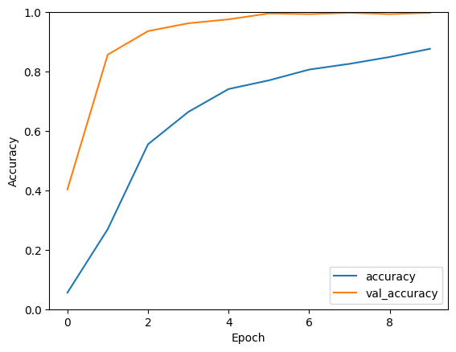

# handwriting-recognition
This project aims to develop an handwriting recognition system using Convolutional Neural Networks (CNNs).The dataset includes images of lowercase alphabets and trained using over 2500 images.

